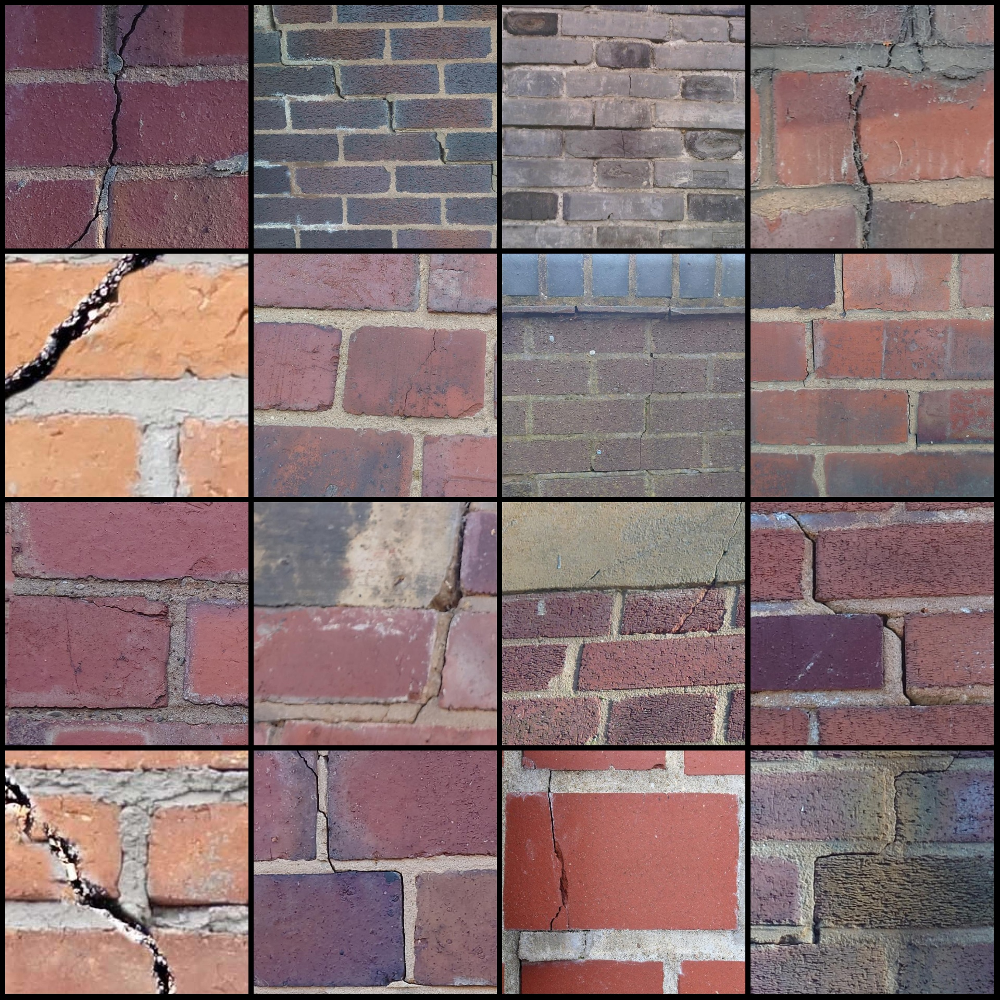
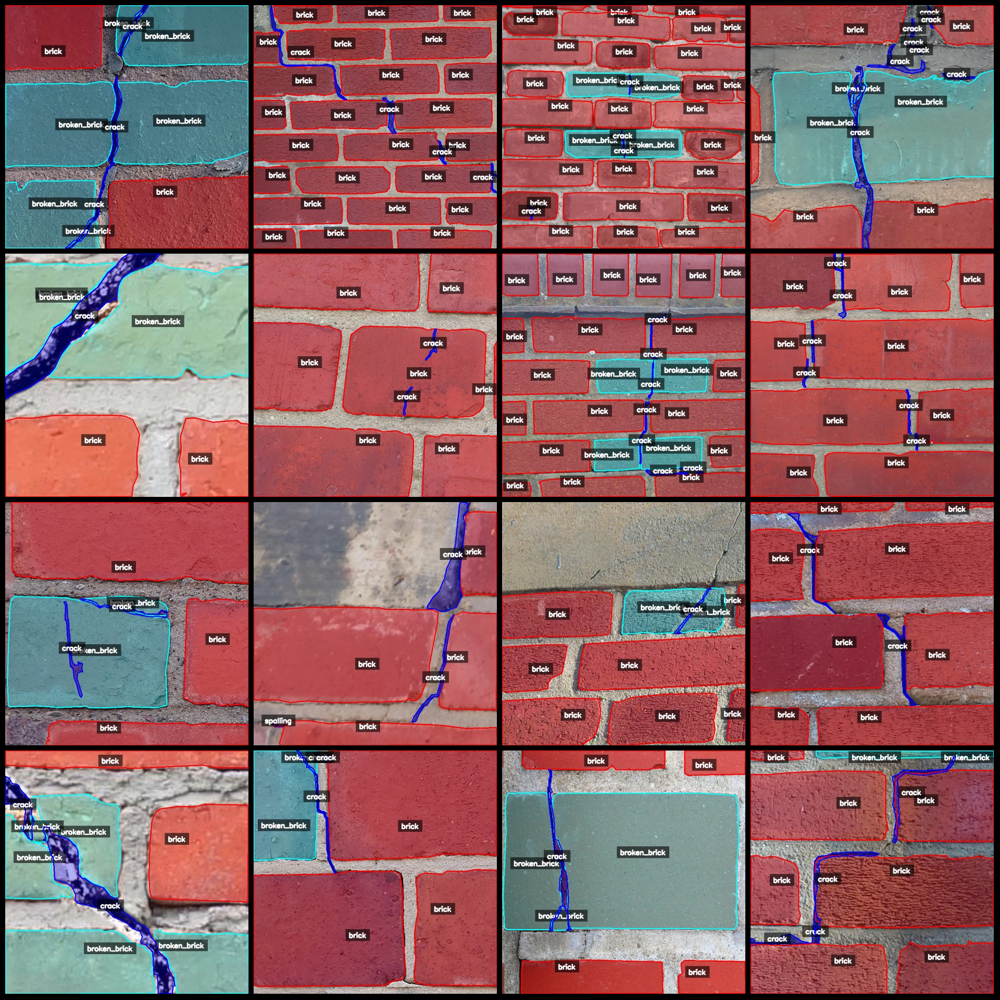
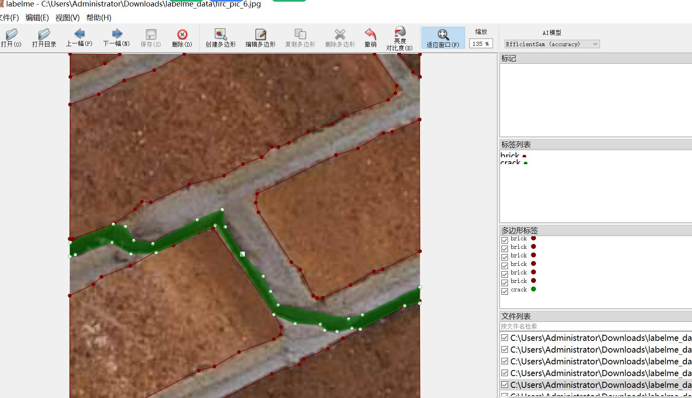
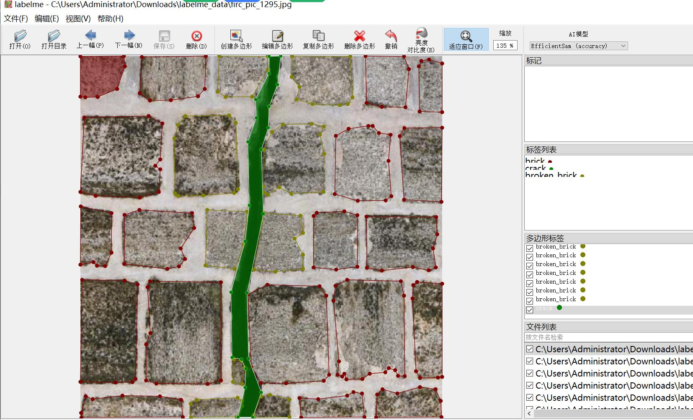

# Wall Crack and Brick Defect Dataset

This dataset consists of 1300 images labeled with 5 categories: "brick", "broken_brick", "crack", "plant", and "spalling". The image resolution is 640x640, and each image is labeled with polygons 
representing the bounding boxes for each category.

The dataset is in labelme format (without a mask file) and contains only JPG images and their corresponding JSON files.

- Image Count: 1300
- Annotation Count: 1300
- Number of Categories: 5
- Category Names: ["brick", "broken_brick", "crack", "plant", "spalling"]
- Number of Boxes per Category:
  - brick (brick) count = 14082
  - broken_brick (broken brick/damaged brick) count = 3371
  - crack (crack) count = 3211
  - plant (plant) count = 44
  - spalling (spalling) count = 295
- Total Boxes: 21003

The dataset can be opened and edited using labelme=5.5.0. If you need to convert the JSON dataset into a mask or instance segmentation format for use with models like YOLO or Mask R-CNN, you will 
need to do so manually.

Note: This dataset does not guarantee the accuracy of the trained model or any weights files.

Image Preview:

Example of an image (choose 16 randomly):


Labeled result:

```
{
    "image": {
        "id": "image1",
        "width": 640,
        "height": 640,
        "filename": "image1.jpg"
    },
    "category": "brick",
    "box": [
        {
            "x": 200,
            "y": 200,
            "width": 200,
            "height": 200,
            "label": "brick"
        }
    ]
}
```

[Image preview example](path_to_image)

Image







Here is a pay link on Stripe ( https://buy.stripe.com/3cs8yP7sY87d0vu9AB ). Please contact me lonlonago@foxmail.com after funding $89, and I will send you a complete data files , thank you!


